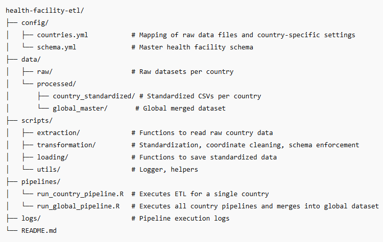
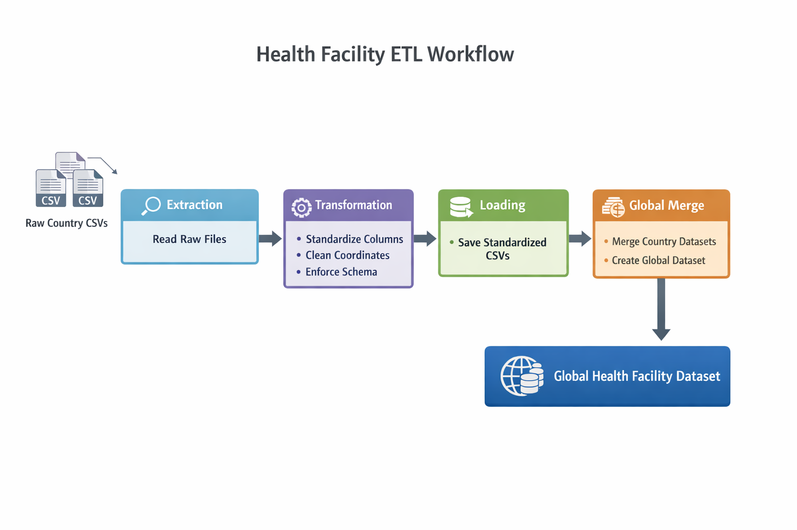

# Health Facility ETL Pipeline
Overview
The Health Facility ETL Pipeline is a standardized, reproducible framework to collect, clean, harmonize, and merge health facility data from multiple countries in Sub-Saharan Africa. The goal is to create a global health facility dataset that is standardized, validated, and ready for downstream analysis such as geospatial modeling, accessibility studies, and reporting.

# This project handles:
- Multi-country raw health facility datasets (currently Tanzania, Uganda, Zambia, Nigeria, Malawi)

- Data harmonization using a master schema

- Coordinate cleaning and validation

- Automated ETL execution per country

- Global dataset creation by merging standardized country datasets

# Key Features
- Standardized schema ensures all health facilities have consistent identifiers, service categories, administrative hierarchy, and geospatial fields.

- Reusable R scripts for extraction, transformation, and loading (ETL).

- Automated pipeline for running country-level ETL and generating a global dataset.

- Logging at each step for debugging and traceability.

- Flexible structure for adding new countries in the future.

# Project Structure


# Methodology / ETL Workflow

The pipeline follows these steps:

# 1️. Extraction

- Raw CSV files are read for each country.

- Country-specific configurations are applied (file paths, column mappings).

# 2️. Transformation

- Column standardization: Raw country columns are mapped to a standardized schema.

- Primary attributes are enforced in all datasets, ensuring consistency across countries. These include:

 -- Unique facility identification (ID)

 -- Facility name

  --Facility level / designation

  --Ownership type

  --Operational status

  --Geographic location (latitude/longitude)

  --Services endorsed (officially approved or designated)

These primary attributes were selected following WHO guidance on Master Facility Lists: [World Health Organization. Master facility list resource package: guidance for countries wanting to strengthen their master facility list. 2017](https://www.who.int/publications/i/item/-9789241513302) Accessed 14 Aug 2024.

- Secondary attributes (e.g., reporting structure, contact details, catchment population) will be added in future iterations.

- Coordinate cleaning: Latitude and longitude values are validated and cleaned.

- Schema enforcement: Each column type is enforced according to schema.yml. Missing columns are added as NA.

# 3️. Loading

- Cleaned, standardized country-level datasets are saved in data/processed/country_standardized/.

- Pipeline logs are written to logs/pipeline_log.csv.

# 4️. Global Merge

- All standardized country CSVs are read.

- Schema is enforced again to guarantee consistency.

- Datasets are merged into a single global dataset: data/processed/global_master/global_health_facilities.csv.

# Workflow Diagram


# How to Run
- Run a single country pipeline:
  ```{r}
  source("pipelines/run_country_pipeline.R")
  run_country_pipeline(country = "uganda", countries_config, schema)
 ```

- Run the global pipeline:
```{r}
source("pipelines/run_global_pipeline.R")
# This will run all country pipelines and produce the merged global dataset
```

# Adding a New Country

- Place the raw CSV in data/raw/.

- Update config/countries.yml with file path and column mapping.

- Run run_global_pipeline.R — the new country will be automatically processed and included in the global dataset.

# Logging

- Every pipeline step (country or global) is logged in logs/pipeline_log.csv.

- Logs include timestamp, country, step, status, message.

- Helpful for debugging or monitoring the ETL process.

# Notes / Best Practices

- Always enforce schema before saving standardized CSVs.

- Column names must match schema to ensure consistency.

- Global merge reads standardized CSVs — do not rely on function return values.

- Keep data/processed/ folder organized; it is the source of truth for global datasets.
